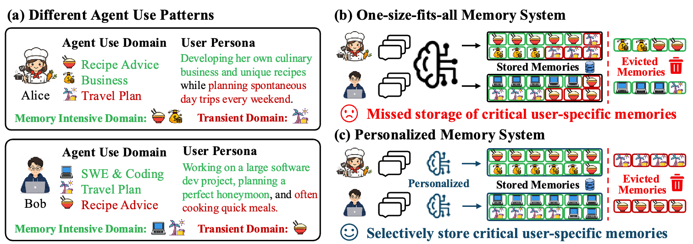
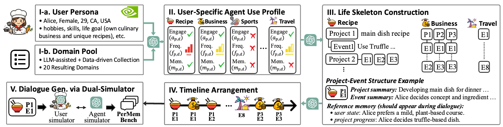

# Personalize-then-Store: Benchmarking and Learning Personalized Memory for Long-horizon Agents

[](https://arxiv.org/abs/2605.25535)

> **Yeonjun In, Wonjoong Kim, Sangwu Park, Kanghoon Yoon, Chanyoung Park**
>
> KAIST

## Overview

Existing LLM-based memory systems apply **universal, static policies** that overlook a fundamental reality: the contexts that are worth storing in memory are different across users. This misalignment wastes limited memory budget on transient interactions while failing to preserve critical context for long-horizon tasks.

As illustrated below, users exhibit **heterogeneous agent use patterns**. For Alice, *Recipe Advice* is a long-horizon project while *Travel Plan* is transient — and exactly the reverse holds for Bob. A universal memory system evicts essential context for one user while unnecessarily storing another's. An ideal personalized memory policy infers each user's worth-storing sessions and selectively manages memory accordingly.




**(a)** Users exhibit distinct agent use patterns. **(b)** One-size-fits-all memory systems fail to personalize these user-specific needs, leading to the eviction of essential contexts. **(c)** An ideal personalized memory policy selectively preserves essential contexts tailored to each user's use pattern.

## PerMemBench

We introduce **PerMemBench**, the first benchmark for evaluating personalized memory systems, featuring **multi-year, multi-domain interaction histories** across diverse user personas. The benchmark is constructed through a fully automated three-stage pipeline:

1. **User-specific agent use profiling** — Generate diverse user personas and profile their domain-level usage patterns (long-horizon vs. transient).
2. **Life skeleton and timeline construction** — Build a structured long-horizon trajectory per user, covering events before and after behavioral pattern shifts.
3. **Dialogue synthesis** — Generate realistic session-level dialogues via an LLM-based user simulator grounded in the life skeleton.




The resulting dataset covers **20 users × multi-year sessions × diverse domains**. Since the pipeline is fully automated, it can be readily scaled to larger and more diverse cohorts.

## Session-level Storage Gating

We propose **session-level storage gating**, a lightweight personalization framework that:
- After each session, predicts whether the session is **long-horizon** (worth storing) or **transient** (skip memory operations).
- Requires **no modification** to the underlying memory system.
- Concentrates the memory budget on sessions that genuinely benefit from long-term accumulation.

We introduce three gating baselines of increasing contextual richness:

| Method | Description |
|---|---|
| **Greedy** | Predicts gating from the current session only, no prior context. |
| **Context-aware** | Uses a sliding window of recent session summaries as context. |
| **Structure-aware** | Explicitly models cross-session structure via a maintained structural note that tracks projects and isolated sessions. |

Reference points: **Universal** (no gating, current deployed systems) and **Oracle** (perfect ground-truth gating, upper bound).

## Key Findings

- **Perfect gating yields substantial retention gains** under tight memory budgets, confirming the value of personalization.
- **Accurate gating remains an open challenge** — current baselines achieve only incremental gains, with gating F1 well below oracle.
- Personalization benefits are **most pronounced under tighter memory budgets**, underscoring its critical importance for real-world deployment.

---

## Repository Structure

```
.
├── 1_*                          # Persona metadata generation and filtering
├── 2_*, 3_*                     # Life skeleton and timeline construction
├── 4_dialogue_gen.py            # Dialogue generation
├── 5_run_mem0.py                # Base Mem0 memory system run
├── 6_gating_*.py                # Session gating methods (greedy, context, structure)
├── 6_snapshot_augmentation.py   # Post-hoc budget/gating augmentation from snapshots
├── 7_memory_retention_eval.py   # Memory retention rate evaluation
├── 7_MRR_display.ipynb          # Retention results analysis
├── sh/                          # Shell scripts for end-to-end runs
└── PerMemBench/                 # Released benchmark dataset
```

---

## Getting Started

### Requirements

Python 3.10+ is recommended. Key dependencies:

- `python-dotenv`
- `openai`
- `anthropic` (if using Claude)
- `google-genai` (if using Gemini)
- `sentence-transformers`

### API Keys

Set provider keys in your environment or `.env` file:

```bash
OPENAI_API_KEY=...
ANTHROPIC_API_KEY=...
TOGETHER_API_KEY=...
GOOGLE_API_KEY=...
```

### Download the Released Dataset

The prebuilt dataset is available directly in this repository:

```bash
unzip PerMemBench/PerMemBench.zip -d .
```

You can then use `PerMemBench/` as your `dialogue_path` without running the full generation pipeline.

---

## Running Experiments

### End-to-end pipeline (data generation + experiments)

```bash
bash sh/run_dial.sh <uuid>
```

This runs the full pipeline: persona generation → timeline construction → dialogue generation → memory system runs → evaluation. Pass a `uuid` to parallelize across users.

### Run Mem0 memory system only

```bash
bash sh/run_mem0.sh <granularity(turn|session)> <budget> <dialogue_path> <cuda_visible_devices> \
    [mem0_llm_provider] [mem0_llm_model] [mem0_vllm_base_url] [oracle(true|false)] [uuid] [experiment_name]
```

Example:

```bash
bash sh/run_mem0.sh session -1 PerMemBench 0 openai gpt-5-mini "" false "" exp_mem0
```

### Snapshot augmentation (post-hoc budget/gating simulation)

Run once without strict budgets to save snapshots, then apply budget/gating/eviction configurations post-hoc to reduce repeated LLM costs:

```bash
python 6_snapshot_augmentation.py \
    --source_snapshot_dir <snapshot_path> \
    --entry_budget 300 \
    --skip_sessions gt   # one of: None, gt, results/context_gating, results/greedy_gating, results/structure_gating
```

### Retention evaluation

```bash
bash sh/run_long.sh <snapshot_dir> <uuid> [workers]
```

### Analysis notebooks

- `7_MRR_display.ipynb` — Memory Retention Rate results

---

## Citation

```bibtex
@article{in2026personalize,
  title={Personalize-then-Store: Benchmarking and Learning Personalized Memory for Long-horizon Agents},
  author={In, Yeonjun and Kim, Wonjoong and Park, Sangwu and Yoon, Kanghoon and Park, Chanyoung},
  journal={arXiv preprint arXiv:2605.25535},
  year={2026}
}
```
